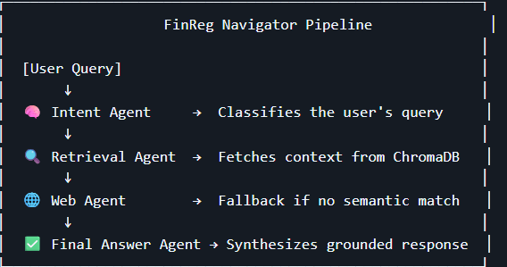
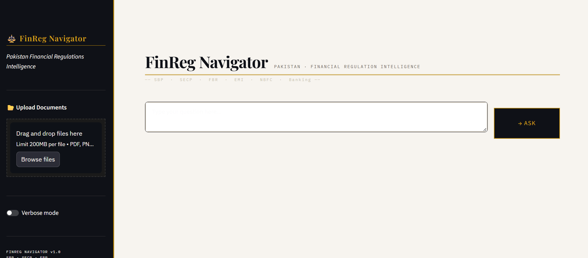
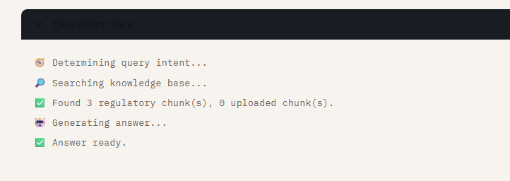

<div align="center">

# 🧭 FinReg Navigator
### **AI-Powered Regulatory Intelligence Engine for Fintech & Digital Banking**

---

</div>

## 🚀 What It Is

**FinReg Navigator** is a state-of-the-art **Retrieval-Augmented Generation (RAG)** system designed to help fintech companies navigate and assess regulatory compliance across multiple jurisdictions.

It enables **automated regulatory reasoning** over structured legal corpora, including:

| 🌍 Jurisdiction | 📋 Frameworks Covered |
|---|---|
| 🇵🇰 **Pakistan** | SBP, FBR, and SRB frameworks |
| 🇦🇪 **UAE** | ADGM virtual asset framework |
| 🇬🇧 **UK** | FCA & EMI regulations |

---

## 💡 Why It Exists

Fintech companies often struggle with complex, multi-jurisdictional hurdles. This tool simplifies:

- 🏦 **EMI Licensing Requirements** & Digital Banking eligibility
- 🔒 **AML/CFT Obligations** across borders
- 💰 **Taxation Compliance** (Sales Tax, Finance Acts)
- ⚖️ **Regulatory Comparison** between different jurisdictions

> **FinReg Navigator** allows compliance teams to query regulatory texts semantically and receive structured responses grounded in official regulatory documents.

---

## 🛠 Example Use Cases

### 1️⃣ Pakistani EMI Expanding to UAE
Compare:
- SBP EMI Regulations 2023
- ADGM Virtual Asset Guidance

### 2️⃣ New Fintech Entering Pakistan
Evaluate:
- EMI capital requirements
- Customer onboarding framework
- AML compliance obligations

### 3️⃣ Tax Impact Analysis
Assess:
- Finance Act 2025 amendments
- Sales Tax Act 1990 updates
- Sindh Sales Tax on Services

---

## 🏗 Architecture

The system operates through a specialized **Agentic Workflow**:



```
┌─────────────────────────────────────────────────────────┐
│                   FinReg Navigator Pipeline              │
│                                                         │
│  [User Query]                                           │
│       ↓                                                 │
│  🧠 Intent Agent     →  Classifies the user's query     │
│       ↓                                                 │
│  🔍 Retrieval Agent  →  Fetches context from ChromaDB   │
│       ↓                                                 │
│  🌐 Web Agent        →  Fallback if no semantic match   │
│       ↓                                                 │
│  ✅ Final Answer Agent → Synthesizes grounded response  │
└─────────────────────────────────────────────────────────┘
```

| Agent | Role |
|---|---|
| 🧠 **Intent Agent** | Classifies the user's query |
| 🔍 **Retrieval Agent** | Fetches context from ChromaDB using semantic embeddings |
| 🌐 **Web Agent** | Acts as a fallback if no strong semantic match is found in local docs |
| ✅ **Final Answer Agent** | Synthesizes the final grounded response |

---

## 💻 Demo

### UI Example



### Execution Trace



---

## 🏗 Project Structure

```
finreg-navigator/
│
├── app/                # Streamlit UI
├── src/
│   ├── agents/         # Intent, Retrieval, Web, Final agents
│   ├── ingest/         # PDF extraction, cleaning, chunking
│   ├── rag/            # Embedding + retrieval logic
│   ├── graph/          # LangGraph orchestration
│   └── llm/            # Ollama clients
│
├── chromadb/           # Vector storage
├── prompts/            # YAML prompt templates
├── assets/             # Demo images
└── README.md
```

---

## 💻 Tech Stack

<div align="center">

| Layer | Technology |
|---|---|
| 🗄️ **Vector Store** | ChromaDB |
| 🔢 **Embeddings** | Sentence Transformers (MiniLM) |
| 🤖 **LLM** | Ollama (Local LLM - Llama3 8B) |
| 🔗 **Orchestration** | LangGraph |
| 🖥️ **UI** | Streamlit |

</div>

---

<div align="center">

*Built for compliance teams navigating the complexity of modern fintech regulation.*

</div>